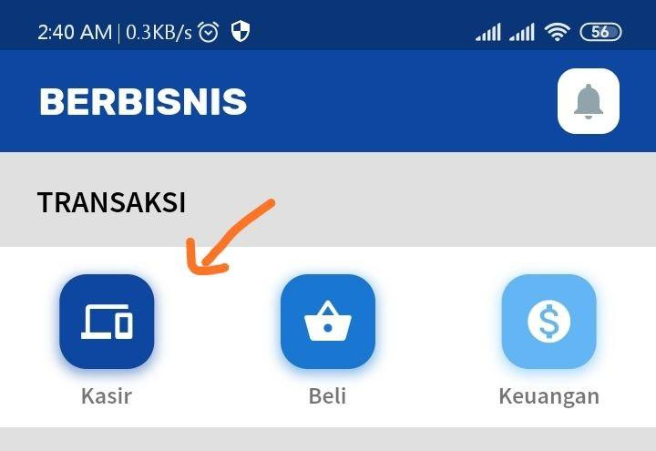
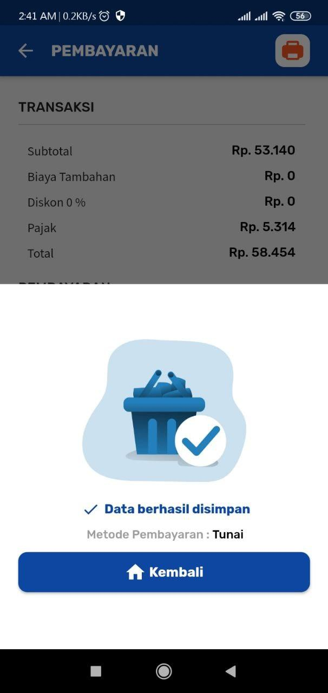

# Tutorial 
SatuKas merupakan aplikasi Penjualan Kasir & Pencatatan Keuangan.

## Fitur 
- Kasir
- Kulakan
- PPN
- Catatan Keuangan
- Riwayat Transaksi
- Laporan Penjualan Barang
- Laporan Pembelian Barang
- Hutang dan Piutang
- Kelola barang etalase
- Pelanggan
- Diskon
- Multi Pengguna
- Sinkronisasi antar device
- Bicoin
- Mode Offline

## Informasi BiCoin
SatuKas menggunakan **BiCoin** sebagai sarana bayar *UTAMA* agar dapat terus digunakan. 

Tiap data yang tersimpan dalam aplikasi SatuKas akan mengurangi saldo **BiCoin**.

Biaya dari Berbisnis dengan **BiCoin** adalah sebagai berikut

|    Jenis Data    |   Biaya       |
|------------------|:-------------:|
| Penjualan        | 10 BiCoin     |
| Catatan Keuangan | 10 BiCoin     |

### Notes
- Anda akan mendapatkan 10.000 **BiCoin** gratis saat pendaftaran awal.
- Anda juga bisa mendapatkan **BiCoin** gratis pada fitur
*BiCoin Reward* pada halaman Utama

***

## Tutorial  

### Instalasi Awal
1. **Login**
   - Klik Button Masuk
    

   - Isikan Nomor HP
    

   - Anda akan mendapatkan SMS ke nomor HP yang terlah dimasukkan
  
   - Masukkan kode yang didapat dari SMS
    
   
2. **Halaman Utama**
 
   
3. **Kelola Barang**
   - Masuk Ke Menu Etalase
    
   
   - **Cari**
     - Klik Tombol "+"
     - Ketik barang yang ingin anda tambah
       
   
     - Klik pada barang yang dimaksut 
     - Jika sudah sesuai, klik Tombol "v" (Kanan Atas)
   - **Tambah Baru**
     - Pada Halaman Pencarian (Jika barang tidak ditemukan)
     - Klik Tombol "+ Baru"
       
   
     - Isikan data sesuai barang anda 
         
   
     - Jika sudah sesuai, klik Tombol "v" (Kanan Atas)
   - **Ubah Harga**
     - Pada Halaman Etalase
     - Klik salah satu barang
       
   
     - Jika sudah sesuai, klik Tombol "v" (Kanan Atas)  
   - **Hapus**
     - Pada Halaman Etalase
     - Slide Ke Kanan salah satu barang
       
   
### Transaksi
3. **Kasir**
   - Pada Halaman Utama
   - Klik Menu Kasir
    
   
   - Klik Tombol "Buka Toko" (Jika belum)
    
   
   - Klik Barang yang dijual
    
   
   - Klik Tombol dengan Icon "Keranjang"
   - Periksa Data Penjualan
    
   
   - Lanjut Pembayaran
    
   
   - Pilih Metode Pembayaran
    
   
   - Selesai
    

4. **Pencatatan Keuangan**
   - Pada Halaman Utama
   - Klik Menu Keuangan
   - Klik Tombol "+" 
    
   
   - Masukkan data catatan
    
   
   - Pilih Kategori Catatan
    
      
   - Jika sudah sesuai, klik Tombol "v" (Kanan Atas)  